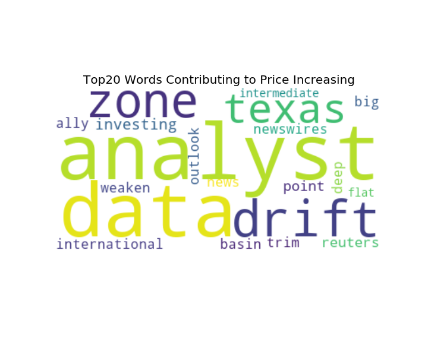
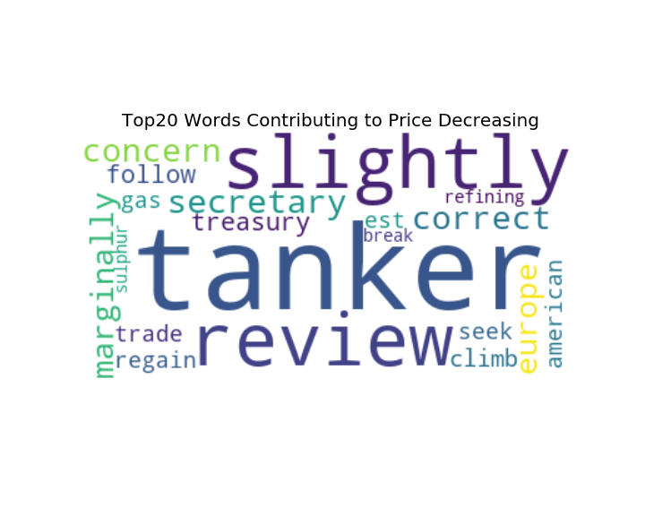
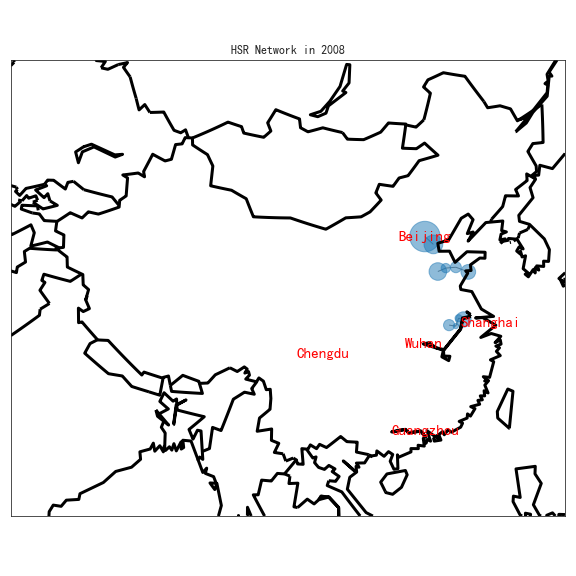
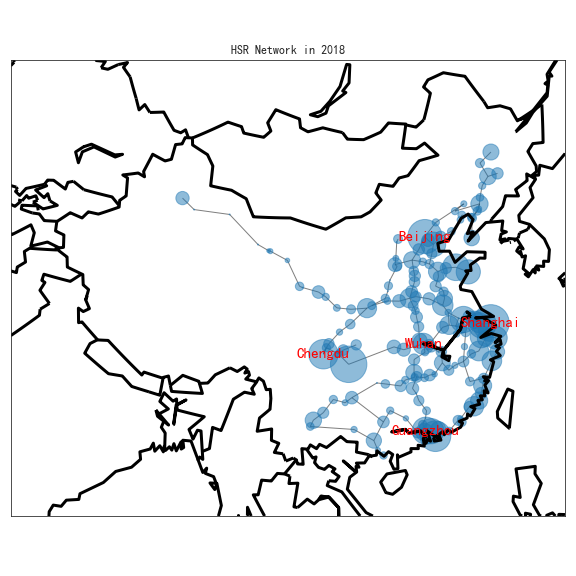
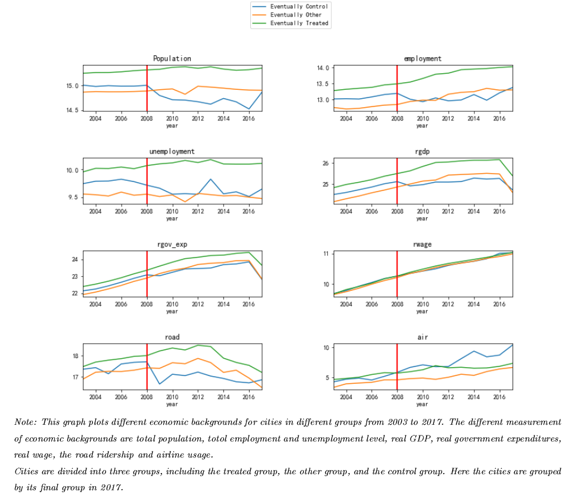
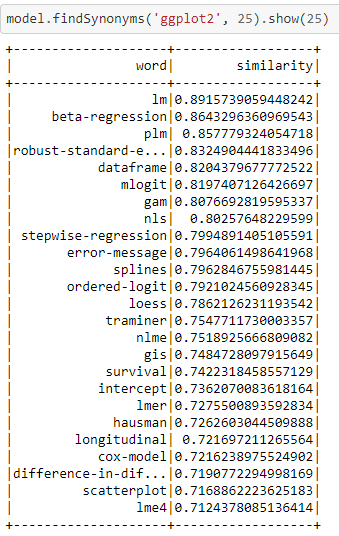

# Portfolio
Zijing's data science project portfolio

# [News Setiment and Topic Analysis on WTI Crude Oil Future Prices](https://github.com/zijing0926/News-Sentiment-and-Topic-Analysis)
* Web scriped over 6000 crude-oil related news articles using urls provided by Bloomberg
* Applied text mining algorithms to [preprocess news articles](https://towardsdatascience.com/a-step-by-step-tutorial-for-conducting-sentiment-analysis-a7190a444366)
* [Transformed cleaned text data with TFIDF Vectorizer](https://towardsdatascience.com/a-step-by-step-tutorial-for-conducting-sentiment-analysis-9d1a054818b6), [utilized Logistic Regression](https://towardsdatascience.com/a-step-by-step-tutorial-for-conducting-sentiment-analysis-cf3e995e3171), LDA, and K-means to conduct sentiment and topic analysis
* Deployed the trained and evaluated machine learning model at [Heroku](https://news-analysis-crude-oil.herokuapp.com/)
* [Academic paper descriping the project in detail](https://www.dropbox.com/s/drj3y7quabgg7r7/news_analysis.pdf?dl=0)

Positive Words             | Negative words
:-------------------------:|:-------------------------:
 | 

# [High-Speed Railway(HSR) Network Growth and Labor Reallocation](https://github.com/zijing0926/Chinese-High-Speed-Railway)
* Conducting casual inference between employment and transportation cost across cities and industries using fixed effect panel regression with R
* Constructed a instrument variablea conducting spatial analysis with angular corrdinates to compute geographic distances among over 200 cities
* Created graphs with Matplotlib and Seaborn for data visualization. and designed geographic maps with GeoPython.
* [Academic paper descriping the project in detail](https://www.dropbox.com/s/7i95i4u2enn5kz6/Chapter2_HSR.pdf?dl=0)

First HSR in 2008          |  HSR Network in 2018
:-------------------------:|:-------------------------:
 | 

# [New York Elite Social Network](https://github.com/zijing0926/New-York-Social-Graph)
* Web scraped over 100,000 photo captions from [New York Social Diary](https://web.archive.org/web/20150913112557/http://www.newyorksocialdiary.com/) and extracted names using Regex and spaCy. 
* Built New York Elite social network using Networkx with the assumption that people in the same picture know each other. 
* Utilized the New York elite social network to find the most popular socialites, most influential people and the most tightly coupled pairs.

Most Influential(Degrees)  | Most Influential (PageRank)| Most tightly coupled
:-------------------------:|:-------------------------: |:-------------------------:
    |         |

# [Distributed Computation: Using Pyspark to Analyze Stack Overflow Posts](https://github.com/zijing0926/Spark)
For a dataset as large as 10GB with stack overflow posts, using RDD, this project:
* filtered out the bad XMLs;
* aggregated posts by the number of favorite counts, and finds the average score for each number of favorites;
* for 99 users with the highest reputation, calculated these users answer percentage by calculating answers/(answers+questions), and the average answer percentage for all users;
* found number of days between account creation and first question for 100 users with the highest reputation;
* identified the veterans for users that has answered or asked a questions between 100 and 150 days after account creation; defined the rest of the users brief users;
* presented the differences in average score, views, number of answers and number of favorites between veterans and brief users and veterans have better stats for all measurements here

Using PySpark DataFrame, this project:
* applied word2vec as an vectorizer for text data, and finds the top 25 closest synonyms to 'ggplot2' and their similarity scores.
* built a machine learning pipeline, takes the body text as the features to predict whether a question contains one of the top ten most common tags
* removed stopwords, tokenized the texts, used HashingTF as the transformer and logistic regression as the estimator; used cross validation to tune hyper parameters.

# [Star Rating Predictions with Machine Learning Models](https://github.com/zijing0926/Star-Rating-Predictions-with-Machine-Learning-Models)
* Utilized Yelp dataset to predict the star rating of new venues based on location, categories and attributes.
* Built customized column selector, categorical variable encoder, linear estimator with residuals fitting non-linear estimator. The full model reaches **95% accuracy** in test set.

# [Analyzing-restaurant-inspection-data-using-sqlite](https://github.com/zijing0926/Analyzing-restaurant-inspection-data-using-sqlite)
This project utilized sqlite to clean and join four different datasets to conduct extensive analysis on New York restaurants’ health and safety scores and violations. Specifically, this project:
* removed the null entries grouping by restaurant and inspection date.
* checked the average inspection score for the most recent inspection by zipcode by merging datasets with certain conditions, and map it on [Carto](https://zzhu0926.carto.com/builder/4e424589-44ec-4d28-85c6-53bf0f418476).
* checked the average inspection score by different borough in New York.
* examined the violations by different cuisine to find out which cuisines tend to have a disproportionate number of what kind of violation. The right quantity to look at is the conditional probability of a specific type of violation given a specific cuisine type and divide it by the unconditional probability of the violation for the entire population.

